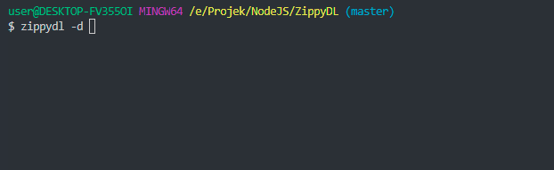

# Zippy DL

Node.js Zippyshare Downloader CLI

[](https://nodei.co/npm/zippydl/)

 


# Install Via NPM

```
$ npm install zippydl -g
```

# Install Via Github

Clone This Repository

```
$ git clone https://github.com/anasrar/Zippy-DL.git
```

Change Directory

```
$ cd Zippy-DL
```

### Install Dependencies

```
$ npm install
```

Link To Binary
```
$ npm link
```

# How To Use


## Download File
```
$ zippydl -d <url>
```
## Download Batch Inline Command
```
$ zippydl -d "https://zippyshare.com,https://zippyshare.com"
```
## Download Batch File
```
$ zippydl -b file.txt
```
In file.txt
```
https://xxx.zippyshare.com/v/xxxx/file.html
https://xxx.zippyshare.com/v/xxxx/file.html
https://xxx.zippyshare.com/v/xxxx/file.html
https://xxx.zippyshare.com/v/xxxx/file.html
```
## Get URL Download File
```
$ zippydl -l <url>
```
## Show Help
```
$ zippydl -h
```

# Demo




# Changelog

## 2.2.0 - 09/27/2019
### Update
- anasrar/Zippy-DL#5 adding new command for get only url file without download

## 2.1.3 - 01/07/2019
### Update
- Fix Old Structure Zippyshare Download Page

## 2.1.2 - 30/06/2019
### Update
- Fix New Structure Zippyshare Download Page

## 2.1.1 - 03/04/2019
### Update
- Nothing new, just clean up the code

## 2.0.1 - 03/04/2019
### Update
- Add Batch Inline Comand
- Fix Bugs Server Download Error

## 1.2.7 - 08/03/2019
### Update
- Support All File
- Add Batch Download
- Fix Some Bugs

## 1.0.4 - 03/03/2019
### Update
- Issues Get Name File Name
- Add To NPM

## 1.0.0 - 01/03/2019
### Other
- Successful Tested

# License

This project is licensed under the MIT License - see the [LICENSE](LICENSE) file for details